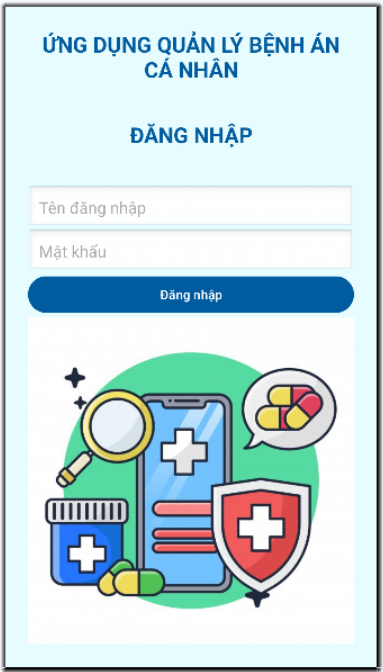
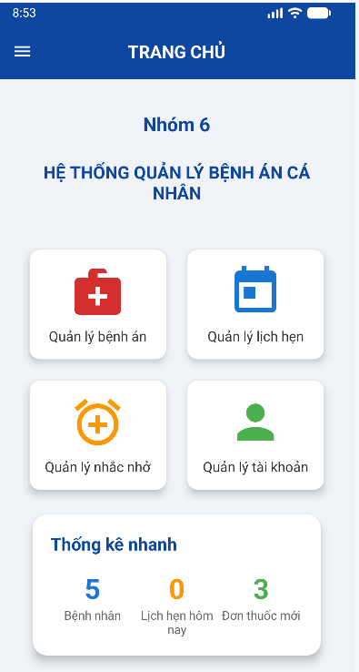
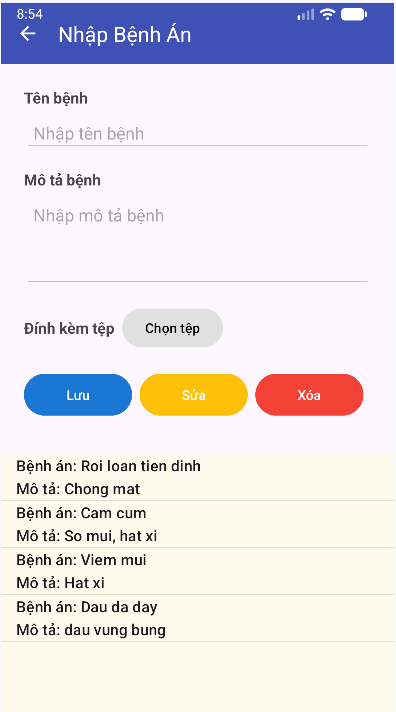
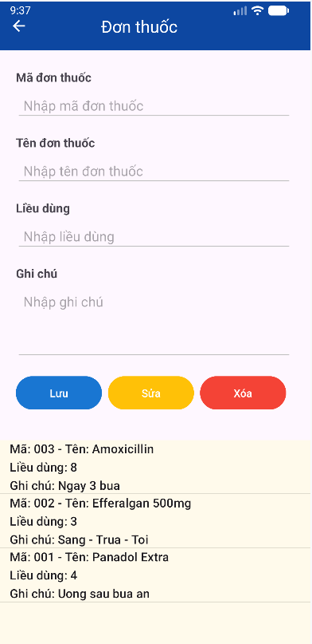
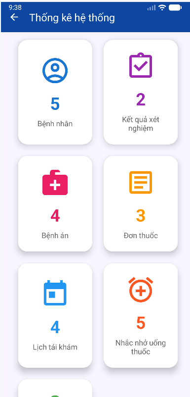

# Personal Medical Records App

An Android application for managing personal medical records, prescriptions, test results, medication reminders, and follow-up appointments.

This application helps users store and manage healthcare information conveniently on mobile devices.

## Technologies

* Kotlin
* Android Studio
* Room Database
* RecyclerView
* Material Design
* Android Jetpack Components

## Features

### Authentication

* User Registration
* Login
* Account Management

### Medical Records

* Create Medical Records
* Update Medical Records
* View Medical History
* Search Medical Records

### Prescription Management

* Manage Prescriptions
* View Prescription Details

### Laboratory Test Results

* Store Test Results
* View Examination History

### Appointment Management

* Schedule Follow-up Appointments
* Manage Appointment Information

### Medication Reminders

* Create Medication Reminders
* Manage Reminder Schedules

### Statistics

* Medical Record Statistics
* Healthcare Data Overview

## Database

The application uses Room Database with the following entities:

* User
* Patient
* BenhAn
* DonThuoc
* KetQuaXetNghiem
* LichHen
* NhacNho

## Screenshots

### Login Screen



### Home Screen



### Medical Records



### Prescription Management



### Statistics



## Installation

### Requirements

* Android Studio
* Android SDK
* Gradle

### Clone Repository

```bash
git clone https://github.com/thangndt201/personal-medical-records-app.git
```

### Open Project

Open the project using Android Studio.

### Build and Run

1. Sync Gradle
2. Build Project
3. Run on Emulator or Android Device
